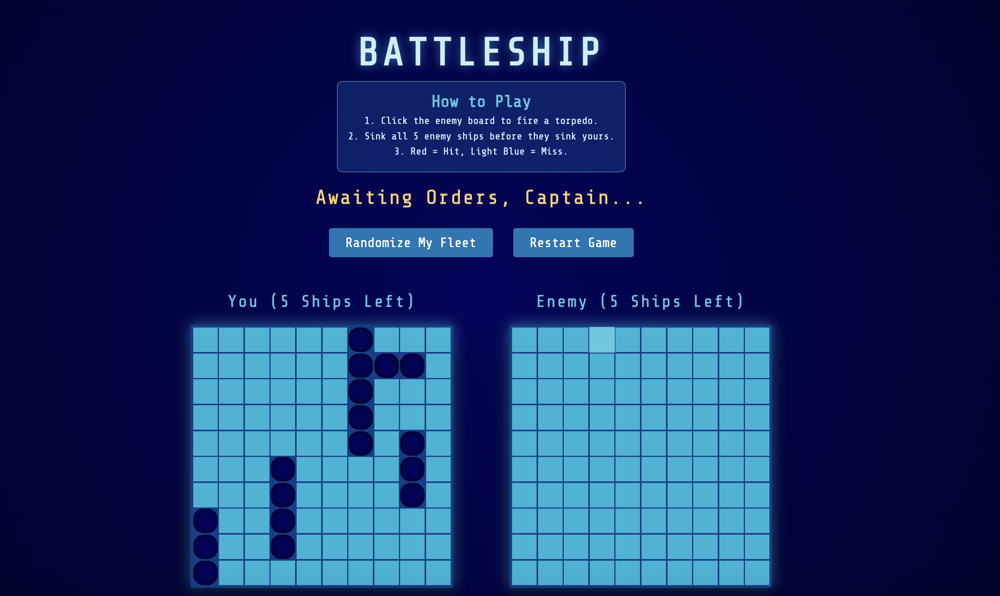

# 🚢 Battleship

A browser-based implementation of the classic Battleship game built using **JavaScript, HTML, and CSS**. 
The application was built with a strict adherence to **Test-Driven Development (TDD)**, ensuring that all game logic, math, and rules were mathematically proven before a single line of UI code was written.

The project focuses on **TDD using Jest, Factory Functions, the Module Pattern, and strict Separation of Concerns**.

## Live Demo

[View on GitHub Pages](https://inaladevi.github.io/battleship/)

## Features

- **Test-Driven Development (TDD)** using Jest to independently verify the logic of Ships, Gameboards, and Players before integrating them with the browser.
- **Factory Functions & Module Pattern** to maintain secure, encapsulated code and prevent the global namespace from being polluted.
- **Strict Separation of Concerns** by isolating all DOM manipulation into a dedicated module, keeping the core game logic entirely decoupled from the visual interface.
- **Automated Opponent Logic** capable of calculating valid, randomized coordinate attacks without repeating previously fired shots.
- **Dynamic Fleet Deployment** allowing players to instantly randomize their ship placements using boundary-aware logic that prevents overlapping or out-of-bounds positioning.
- **Real-Time Game Loop** that sequentially manages player turns, registers hits/misses, updates remaining ship counts, and calculates win/loss conditions.
- **Tactical UI/UX** utilizing CSS Grid for precise board layouts, custom web fonts (`Share Tech Mono`), and immediate visual feedback for hits (explosions) and misses (splashes).

## Built With

- **HTML5**
- **CSS3**
  - CSS Grid (Coordinate mapping)
  - CSS Flexbox
  - Custom Color Variables & Tactical HUD Styling
- **JavaScript (ES6+)**
  - Factory Functions & Modules
  - Event Delegation
  - Array Methods (`filter`, `some`, `forEach`)
- **Jest** (JavaScript Testing Framework)

## Preview

